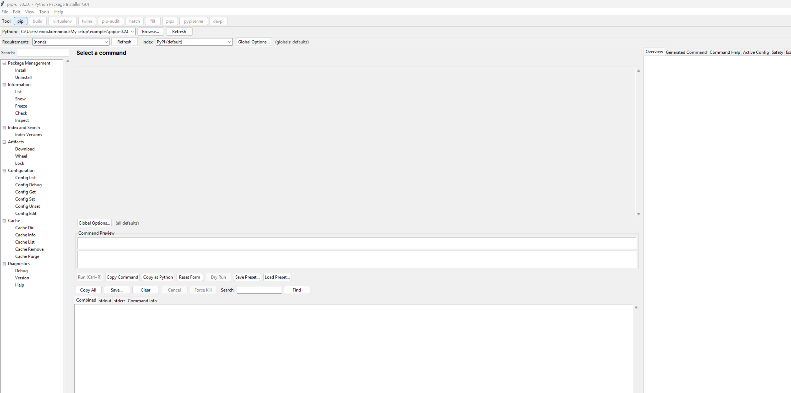

# Bundlr 📦

Bundlr turns a Python application from PyPI or HTTPS Git into a self-contained, double-clickable
application for Windows, macOS, and Linux. Recipients do not need Python, uv, Deno, or Bundlr.

## Package an application

Run Bundlr with a pinned PyPI requirement or HTTPS Git source. Bundlr detects the application
name, entry point, and console/GUI type when possible.

CLI examples:

```sh
bundlr --target all example-app==1.2.3

bundlr --target all \
  https://github.com/example/example-app.git@0123456789abcdef0123456789abcdef01234567
```

Use `--name`, `--command`, or `--kind` only when automatic detection is ambiguous.

Each target produces:

- A relocatable application directory with a double-click launcher.
- A client ZIP or `tar.gz` archive.
- SHA-256 checksums, dependency inventory, licence notices, and build metadata.

## Build Windows applications on Linux or macOS

Run these commands from a Bundlr source checkout. Bundlr prepares its pinned `uv` executable
automatically; the generated applications do not require Python, Deno, Bundlr, `uv`, or a virtual
environment on the Windows machine.

### GUI example: PipUI

```sh
deno task package \
  --name PipUI \
  --command pip-ui \
  --kind windowed \
  --python 3.12 \
  --target windows-x86_64 \
  --output dist/examples/pipui-0.2.0 \
  "pip-ui-tkinter==0.2.0"
```

Send these two files to the Windows user:

```text
dist/examples/pipui-0.2.0/PipUI-windows-x86_64.zip
dist/examples/pipui-0.2.0/PipUI-windows-x86_64.zip.sha256
```

After verifying the checksum and extracting the entire ZIP, double-click:

```text
PipUI-windows-x86_64\PipUI.exe
```

### CLI example: Black

```sh
deno task package \
  --name Black \
  --command black \
  --kind console \
  --python 3.12 \
  --target windows-x86_64 \
  --output dist/examples/black-26.5.1 \
  "black==26.5.1"
```

Send these two files to the Windows user:

```text
dist/examples/black-26.5.1/Black-windows-x86_64.zip
dist/examples/black-26.5.1/Black-windows-x86_64.zip.sha256
```

After verifying the checksum and extracting the entire ZIP, run:

```powershell
.\Black-windows-x86_64\Black.exe --help
.\Black-windows-x86_64\Black.exe --check C:\path\to\python-project
```

Bundlr refuses to overwrite a completed application. Use a new versioned output directory for a
new release.

### Verify an archive with SHA-256

Keep the archive and its `.sha256` file in the same directory. Run the appropriate command from
that directory, and extract the archive only after verification succeeds.

Linux:

```sh
sha256sum --check PipUI-windows-x86_64.zip.sha256
```

macOS:

```sh
shasum -a 256 --check PipUI-windows-x86_64.zip.sha256
```

Windows PowerShell:

```powershell
$archive = ".\PipUI-windows-x86_64.zip"
$expected = ((Get-Content "$archive.sha256" -Raw).Trim() -split "\s+")[0]
$actual = (Get-FileHash $archive -Algorithm SHA256).Hash
if ($actual -ine $expected) { throw "SHA-256 verification failed" }
Write-Host "SHA-256 verification passed"
```

## Verified Linux-to-Windows applications

PipUI 0.2.0 and Black 26.5.1 were bundled on Linux, copied to a Windows machine without a Python installation, 
and launched successfully. PipUI opened as a normal desktop application:



Black ran as a normal Windows command-line executable:

<details>
<summary>Black 26.5.1 <code>--help</code> output captured on Windows</summary>

```text
C:\Users\user> .\black-26.5.1\Black-windows-x86_64\Black.exe --help
Usage: Black.exe [OPTIONS] SRC ...

  The uncompromising code formatter.

Options:
  -c, --code TEXT                 Format the code passed in as a string.
  -l, --line-length INTEGER       How many characters per line to allow.
                                  [default: 88]
...
  -h, --help                      Show this message and exit.
```

</details>

## How cross-target packaging works

Bundlr combines a checksum-pinned target
[Python runtime](https://github.com/astral-sh/python-build-standalone) with target-compatible wheels
selected by [uv](https://docs.astral.sh/uv/). It does not use PyInstaller or execute foreign target
binaries while packaging.

Supported applications are:

- Pure Python; or
- Dependent on native packages that publish wheels for every selected target.

Bundlr rejects missing target wheels and Git projects that build host-specific native code. This
prevents a Linux binary from being accidentally delivered in a Windows or macOS application.

## Development

Requires Deno 2.9.4 or later.

```sh
deno task check
deno task test
deno task build
```

`build` creates the host command-line executable under `dist`; `build:cli` is its explicit
equivalent. The experimental desktop interface remains available through `desktop:dev` and
`desktop:build`, but desktop installers are not published as release artifacts.

GitHub Actions verifies and builds Bundlr CLI executables for Linux x64, Windows x64, macOS ARM64,
and macOS Intel. It publishes those executables when a `v*` tag is pushed. Client applications are
built locally by Bundlr and do not depend on CI.
